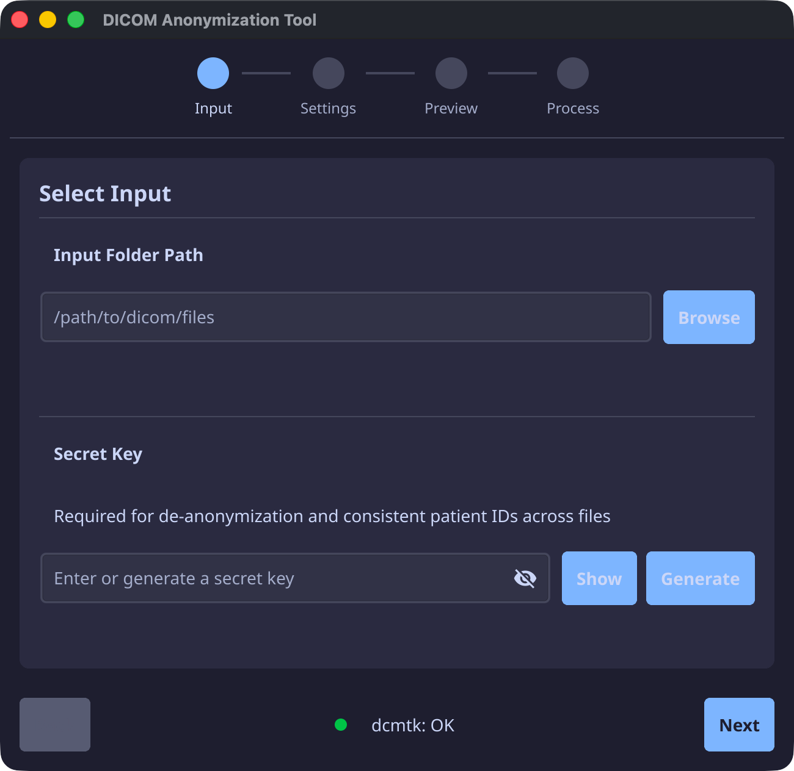

# DICOM Anonymizer

A cross-platform tool for anonymizing DICOM medical imaging files. Supports both **GUI** and **CLI** modes.

<p align="center">
  
</p>

## Table of Contents

- [Features](#features)
- [Downloads](#downloads)
- [Requirements](#requirements)
- [Installation](#installation)
- [Usage](#usage)
  - [GUI Mode](#gui-mode-default)
  - [CLI Mode](#cli-mode)
- [Anonymization Details](#anonymization-details)
- [Building from Source](#building-from-source)

---

## Features

| Feature | Description |
|---------|-------------|
| **Metadata Anonymization** | Removes patient identifying information from DICOM tags |
| **Pixel Redaction** | Blacks out burned-in PHI from ultrasound images |
| **Patient Pseudonymization** | Generates consistent anonymous IDs using a secret key |
| **Multi-modality Support** | CT, MRI, X-Ray, and Ultrasound |
| **Progress Tracking** | Resume interrupted anonymization runs |
| **Cross-platform** | macOS (ARM64 & Intel), Windows, and Linux |

---

## Downloads

Download the latest release for your platform from [GitHub Releases](https://github.com/fomoroller/dicom-anonymizer/releases):

| Platform | Architecture | File |
|----------|--------------|------|
| macOS | Apple Silicon (M1/M2/M3) | `dicom-anonymizer-macos-arm64.zip` |
| macOS | Intel | `dicom-anonymizer-macos-amd64.zip` |
| Windows | 64-bit | `dicom-anonymizer-windows-amd64.zip` |
| Linux | 64-bit | `dicom-anonymizer-linux-amd64.tar.xz` |

## Requirements

### dcmtk (Required)

This application requires **dcmtk** to process JPEG-LS compressed DICOM files. The app will prompt you to install it on first run.

**macOS (Homebrew):**
```bash
brew install dcmtk
```

**Linux (Debian/Ubuntu):**
```bash
sudo apt-get update && sudo apt-get install -y dcmtk
```

**Windows:**
Download from [dcmtk.org](https://dicom.offis.de/dcmtk.php.en) and add to PATH.

## Installation

### macOS

1. Download `dicom-anonymizer-macos-arm64.zip` (Apple Silicon) or `dicom-anonymizer-macos-amd64.zip` (Intel)
2. Extract the zip file
3. Move `dicom-anonymizer.app` to your Applications folder
4. On first launch, right-click and select "Open" to bypass Gatekeeper

### Windows

1. Download `dicom-anonymizer-windows-amd64.zip`
2. Extract the zip file
3. Run `dicom-anonymizer.exe`

### Linux

1. Download `dicom-anonymizer-linux-amd64.tar.xz`
2. Extract: `tar -xf dicom-anonymizer-linux-amd64.tar.xz`
3. Run: `./dicom-anonymizer`

## Usage

### GUI Mode (Default)

Simply run the application without arguments to launch the graphical interface.

```bash
./dicom-anonymizer
```

### CLI Mode

Run from the command line for automation and scripting.

#### Basic Usage

```bash
# Anonymize all DICOM files in a folder (all modalities, recursive)
./dicom-anonymizer -i /path/to/dicoms -k YOUR_SECRET_KEY
```

That's it! With just `-i` (input folder) and `-k` (secret key), the tool will:
- ✅ Search all subdirectories
- ✅ Process all modalities (CT, MRI, X-Ray, Ultrasound)
- ✅ Apply 75px redaction to ultrasound images
- ✅ Save mapping to `patient_mapping.json` in parent folder
- ✅ Output anonymized files to `{input}/anonymized/`

#### Recommended Workflow

```bash
# Step 1: Do a dry run first to preview and get a secret key
./dicom-anonymizer -i /path/to/dicoms -n

# Step 2: SAVE the generated key shown in output!
# Step 3: Run with your saved key
./dicom-anonymizer -i /path/to/dicoms -k YOUR_SAVED_KEY
```

#### Processing Multiple Modalities (Same Patients)

Use the **same secret key** for all modalities to maintain consistent patient IDs:

```bash
# Process CT scans
./dicom-anonymizer -i /data/CT_Scans -k a1b2c3d4e5f6g7h8

# Process MRI scans with SAME key
./dicom-anonymizer -i /data/MRI_Scans -k a1b2c3d4e5f6g7h8

# Process Ultrasound with SAME key
./dicom-anonymizer -i /data/Ultrasound -k a1b2c3d4e5f6g7h8

# Result: "John Smith" → ANON-000001 across ALL modalities
```

#### ⚠️ Security: Keep These Secret

| Item | Why it's sensitive |
|------|-------------------|
| **Secret Key** | Required to maintain consistent patient IDs |
| **patient_mapping.json** | Contains original ↔ anonymous ID links - **enables re-identification** |

**Only share the anonymized files** in the `anonymized/` folder. Never share the key or mapping file.

#### CLI Flags Reference

| Flag | Short | Default | Description |
|------|-------|---------|-------------|
| `--input` | `-i` | (required) | Input folder containing DICOM files |
| `--key` | `-k` | auto-generate | Secret key (SAVE THIS!) |
| `--mapping` | `-m` | `{parent}/patient_mapping.json` | Mapping file location |
| `--redact-rows` | | `75` | Pixels to redact from ultrasound top |
| `--recursive` | `-r` | `true` | Search subdirectories |
| `--retry` | | `false` | Retry previously failed files |
| `--metadata` | | `true` | Process CT/MRI/X-Ray |
| `--ultrasound` | | `true` | Process ultrasound with redaction |
| `--dry-run` | `-n` | `false` | Preview only, no changes |
| `--help` | `-h` | | Show help |

#### Advanced Examples

```bash
# Process only CT/MRI/X-Ray (skip ultrasound)
./dicom-anonymizer -i /path/to/dicoms -k KEY --ultrasound=false

# Process only ultrasound with custom redaction
./dicom-anonymizer -i /path/to/dicoms -k KEY --metadata=false --redact-rows=100

# Retry failed files from previous run
./dicom-anonymizer -i /path/to/dicoms -k KEY --retry

# Custom mapping file location
./dicom-anonymizer -i /path/to/dicoms -k KEY -m /secure/mappings.json
```

#### CLI Output Example

```
DICOM Anonymizer
==================================================
Input:     /data/CT_Scans
Mapping:   /data/patient_mapping.json
Key:       a1b2c3d4e5f6g7h8i9j0k1l2m3n4o5p6

WARNING: Secret key was auto-generated!
         SAVE THIS KEY to maintain consistent patient IDs
         across different imaging modalities (CT, MRI, US, X-Ray).
         Re-run with: -k a1b2c3d4e5f6g7h8i9j0k1l2m3n4o5p6

Modality:  CT/MRI/X-Ray, Ultrasound (75px redaction)
Options:   Recursive

[##################################################] 100%  (156/156)

==================================================
Complete! 150 succeeded, 4 failed, 2 skipped
Patients:  12 total (10 by Name+DOB, 2 by PatientID)
Output:    /data/CT_Scans/anonymized
Mapping:   /data/patient_mapping.json
```

---

### GUI Wizard

#### Step 1: Select Input

1. Click **Browse** to select the folder containing your DICOM files
2. Enter or generate a **Secret Key** (required for consistent anonymization)
   - Click **Generate** to create a new key
   - **Important**: Save this key securely! You'll need it to maintain consistent patient IDs

### Step 2: Configure Settings

- **Modality Types**: Select which types of files to process
  - CT / MRI / X-Ray: Metadata anonymization only
  - Ultrasound: Metadata + pixel redaction (burns out top N rows)
- **Options**:
  - Search subdirectories: Process files in subfolders
  - Retry failed files: Re-attempt previously failed files
- **Mapping File**: Location to store patient ID mappings

### Step 3: Preview

Review the files that will be processed and the patient ID mappings.

### Step 4: Process

Click **Process** to begin anonymization. Progress is shown in real-time.

## Anonymization Details

### Fields Cleared
- Patient Name, Birth Date, Age, Address, Phone
- All physician names (referring, performing, operators)
- Accession Number, Study ID
- Institution Address, Department Name, Station Name
- Times (Study, Series, Acquisition, Content)

### Fields Preserved
- Patient Sex (clinical relevance)
- Institution Name (research tracking)
- Study/Series Description (clinical context)

### Date Handling
- Dates are truncated to the 1st of the month (e.g., 20260115 -> 20260101)

### Ultrasound Pixel Redaction
- Top N rows are blacked out to remove burned-in PHI
- Default: 75 pixels from top

## Building from Source

### Prerequisites

- Go 1.21 or later
- Fyne dependencies (see [fyne.io](https://fyne.io/develop/))

**macOS:**
```bash
xcode-select --install
```

**Linux (Ubuntu/Debian):**
```bash
sudo apt install libgl1-mesa-dev xorg-dev
```

### Build

```bash
# Install dependencies
make deps

# Build native binary
make build

# Run
make run
```

### Cross-compile

Requires Docker and fyne-cross:

```bash
# Install fyne-cross
go install github.com/fyne-io/fyne-cross@v1.5.0

# Build for all platforms
make cross-compile
```

## Project Structure

```
dicom-anonymizer/
├── cmd/anonymizer/      # Main application entry point
├── internal/
│   ├── anonymizer/      # Core anonymization logic
│   ├── cli/             # Command-line interface
│   ├── dicom/           # DICOM file reading/writing
│   ├── gui/             # Fyne GUI (wizard, theme)
│   ├── identity/        # Patient pseudonymization
│   ├── jpegls/          # JPEG-LS encoder/decoder
│   └── progress/        # Progress tracking
├── build/
│   └── releases/        # Pre-built binaries
└── Makefile
```

---

## License

MIT License

---

## Support

For issues and feature requests, please use [GitHub Issues](https://github.com/fomoroller/dicom-anonymizer/issues).
